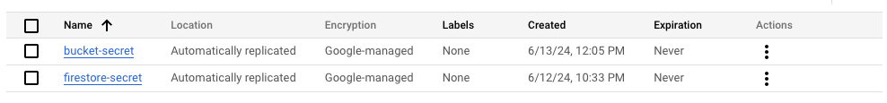
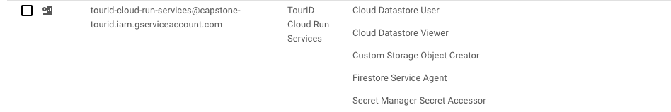
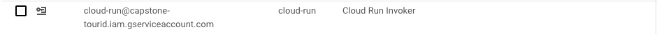

<h1 align="center">
  <br>
    
  <br>
    TourID
  <br>
   <p><em>One Click, Many Destination</em></p>
</h1>

## Table of Contents
- [Architecture](#architecture)
- [Development](#development)
- [Deployment](#deployment)
  - [Firebase](#firebase)
  - [Cloud Storage](#cloud-storage)
  - [Secret Manager](#secret-manager)
  - [Service Account](#service-account)
  - [Cloud Run](#cloud-run)
- [Project Structure](#project-structure)
- [API Documentation](#api-documentations)
- [Cloud Computing Team](#cloud-computing-team)

## Architecture

## Development
- Clone this repository
```
git clone https://github.com/TourID/Cloud-Computing
```

- Create virtual environment folder
```
python -m venv your_venv_folder
```

- Activate your virtual environment
  <br>
  Windows:
  ```
  .\your_venv_folder\Scripts\activate
  ```
  MacOS/Linux:
  ```
  source your_venv_folder/bin/activate

- Install dependencies
```
pip install -r requirements.txt
```
- Run the app
```
python3 app.py
```

## Deployment

### Cloud Storage
- Create a bucket
  - Default class: Standard
  - Enforce public access prevention
  - Uniform access control enabled
- The required outcomes is `BUCKET_NAME`

### Secret Manager
- Add secrets for your credentials
  <br>
  Refer to the image below for an example:
  <br>


### Service Account
- Create 2 new service accounts
  - Cloud Run
    - Cloud Run Invoker role
  - TourID Cloud Run Services
    - Cloud Datastore User
    - Cloud Datastore Viewer
    - Custom Storage Object Creator
    - Firestore Service Agent
    - Secret Manager Secret Accessor
    <br>
  Refer to the image below for an example
   <br>



### Cloud Run
Submit a build using Google Cloud Build
- Create a new service with the main container image
  - Environment variables from secrets: `BUCKET_SECRET_NAME`, `FIRESTORE_SECRET_NAME`
  - Ingress control: `All`
  - Authentication: `Allow unauthenticated invocations`
  - Service account: `TourID API`

## Project Structure
```
├── app.py
├── .gitignore
├── Dockerfile
├── README.md
├── requirements.txt
├── assets/
│   ├── secret-manager.png
│   ├── service-acc-1.png
│   ├── service-acc-2.png
│   └── tourid.png
├── config/
│   ├── __init__.py
│   ├── bucket-config.json
│   ├── config.py
│   ├── firestore-config.json
│   └── gcs.py
├── models/
│   ├── __init__.py
│   ├── best_model.keras
│   ├── encodings.py
│   ├── model.py
│   ├── place_data.csv
│   ├── place_to_place_encoded.pkl
│   └── user_to_user_encoded.pkl
├── myvenv/
├── routes/
│   ├── __init__.py
│   ├── bookmarks.py
│   ├── model.py
│   ├── places.py
│   ├── reviews.py
│   └── users.py
```
## API Documentation
The details of the API documentation can be accessed [here](https://documenter.getpostman.com/view/10002265/2sA3XSA1Vh).
